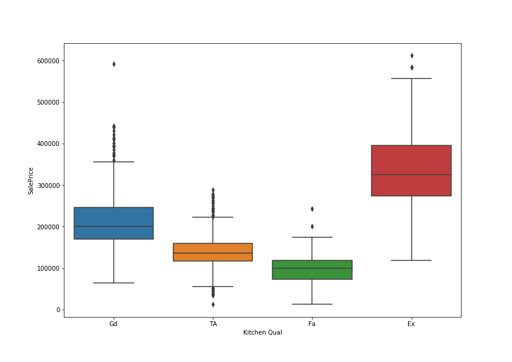

# Project 2 Ames, Iowa README

### Table of Contents:
- [The Data](#The-Data)
- [Exploratory Data Analysis](#Exploratory-Data-Analysis)
- [Brief Summary of EDA](#Brief-Summary-of-EDA)
- [Model 1: Linear Regression with Numerical Variables and log(SalePrice)](#Model-1:-Linear-Regression-with-Numerical-Variables-and-log(SalePrice))
- [Model 2: Linear Regression with Numerical and Categorical Variables with log(SalePrice)](#Model-2:-Linear-Regression-with-Numerical-and-Categorical-Variables-with-log(SalePrice))
- [Model 3: Polynomial Terms](#Model-3:-Polynomial-Terms)
- [Model 4: Ridge Regression](#Model-4:-Ridge-Regression)
- [Model 5: Lasso Regression](#Model-5:-Lasso-Regression)
- [Final Model and Interpretation](#Final-Model-and-Interpretation)
- [Kaggle Competition](#Kaggle-Competition)
- [Conclusions and Recommendations](#Conclusions-and-Recommendations)

## 1.0 Directory Structure

```
.
├── project_2
    ├── Code
        ├── Project_2_Report.ipynb
    ├── datasets
        ├── sample_sub_reg.csv
        ├── test.csv
        ├── train.csv
    ├── Notebooks
        ├── Data_Cleaning.ipynb
        ├── Exploratory_Analysis.ipynb
        ├── Kaggle_Competition.ipynb
        ├── Lasso_Model.ipynb
        ├── Ridge_Model.ipynb
    ├── Plots
        ├── heatmap.png
        ├── kitchen_qual.png
        ├── neigh_scatter.png
        ├── saleprice_neighborhood_housestyle.png
        ├── saleprice_spec_neighborhood_housestyle.png
        ├── swarm.png
    ├── Submissions
        ├── real_submission.csv
        ├── real_submission2.csv
        ├── real_submission3.csv
        ├── submission_bad.csv
        ├── submission_cont.csv
        ├── submission_cont_normalize.csv
        ├── submission_cont_pricelog.csv
        ├── submission_good.csv
        ├── top_kaggle_submission.csv
    ├── README.md
    └── Project_2_Ames_Iowa.pdf
```

## 2.0 Problem Statement

### **The purpose of this project is to create a regression model, based on the Ames Housing Dataset, towards the goal of predicting the price of a house at sale. We construct different types of regression models, such as Ordinary Least Squares, Ridge, and Lasso and measure their performance with the R^2 metric for both train and test sets as well as the cross validation score. At the end of this project, we'd like to be able to tell real estate agents which features predict the sale price of a house well and how to interpret it. We caution that as soon as the models and transforms become more complex, it's harder to interpret. However, for the sake of this project, we will still perform certain transformations.**

---
## 3.0 Description of Data

### 3.1 Size

* 2,051 rows, each represent a house
* 81 original columns, more added during analysis (dummies and has pool)

### 3.2 Source

* train : https://www.kaggle.com/c/dsi-us-10-project-2-regression-challenge/data
* test : https://www.kaggle.com/c/dsi-us-10-project-2-regression-challenge/data

### 3.3 Data Dictionary

The description of this data including the features can be found here: https://www.kaggle.com/c/dsi-us-10-project-2-regression-challenge/data

---
## 4.0 Data Visualization


<center> This plot is an overview for each neighborhood, their sale prices, and the house style. Looking at one neighborhood, we can easily pick out the most expensive house and least expensive house as well as what type of house it is. It shows which house style is most 'popular' in each neighborhood and we can generally visualize the mean sale price of each neighborhood.


<center> Let's specifically look at the neighborhood 'Sawyer'. From the plot we can see that the most expensive house was a 2 story around 225,000 dollars and the least expensive house was a 1 story around 70,000 dollars. We also see that most houses sold in this neighborhood were 1 stories. Also, we can just eyeball that the mean sale price of this neighborhood is lower than the mean sale price of neighborhood Bloomington.



<center> We see there's a pretty big difference between the sale's price means according to the quality of the kitchen. We might want to put this feature into the model
    


<center> This plot nicely shows that there is a lot of variability for sale price dependent on the Neighborhood. We can see that some neighborhoods have more observations, some are more spread out, and some have a couple outliers whereas others don't. To emphasize this point, we plot each neighborhood's mean sale price below.
    

    
<center> This plot clearly shows that the means of the Sale price for each neighborhood are all over the place. Similar to month, the mean sale price of each neighborhood looks very scattered. However, the range of mean sale price for neighborhood has a much larger range than month sold, 100,000-350,000. We should certainly keep the neighborhood feature in our model.
    


<center> This plot shows the correlation between each numerical variable and our target response, sale price. This is how we chose the numerical features to keep in the model.

<center> 
    
---
## 5.0 Conclusion

Remember that we want to present our model to real estate agents or house flippers. We ignore the more complex models and only use an OLS linear model with selected features and a log transform on Sale Price. We can say that our model explains about 89% of the variation in y relative to its mean. Again, I'm most interested in Neighborhood and how it impacts the sale price. It seems like the neighborhood, Green Hill, has the highest Beta coefficient while also having a significant p-value. All else being held equal, the sale price of a house in Green Hill is about 45% more expensive than the next highest neighborhood, Greens. 

An important numerical feature was Overall Quality with a beta coefficient of around 0.07. This seems to very significant indicating that for one unit increase in the overall quality, the sale price increases by about 7%. 

It's also interesting to note some of the negative betas. For example, the feature 'total rooms above ground' has a significant p value and a beta coefficient of -0.01. I think this would make sense in certain neighborhoods. You'd think that in an affluent neighborhood, more rooms would mean more expensive. However in a not-so-affluent neighborhood, more rooms might mean that multiple families live there therefore making the sale price decrease.

### 5.1 Next Steps

In the future, we might want to creat an interaction term between Neighborhood and Total Rooms above ground. What would also be interesting is to see how exactly 'Overall Quality' is being determined.  

---
## 6.0 Outside Sources

- https://www.kaggle.com/c/dsi-us-10-project-2-regression-challenge/data
- https://www.greenhillsrc.com/